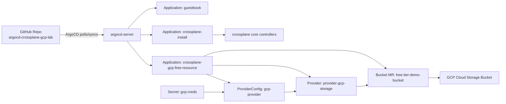
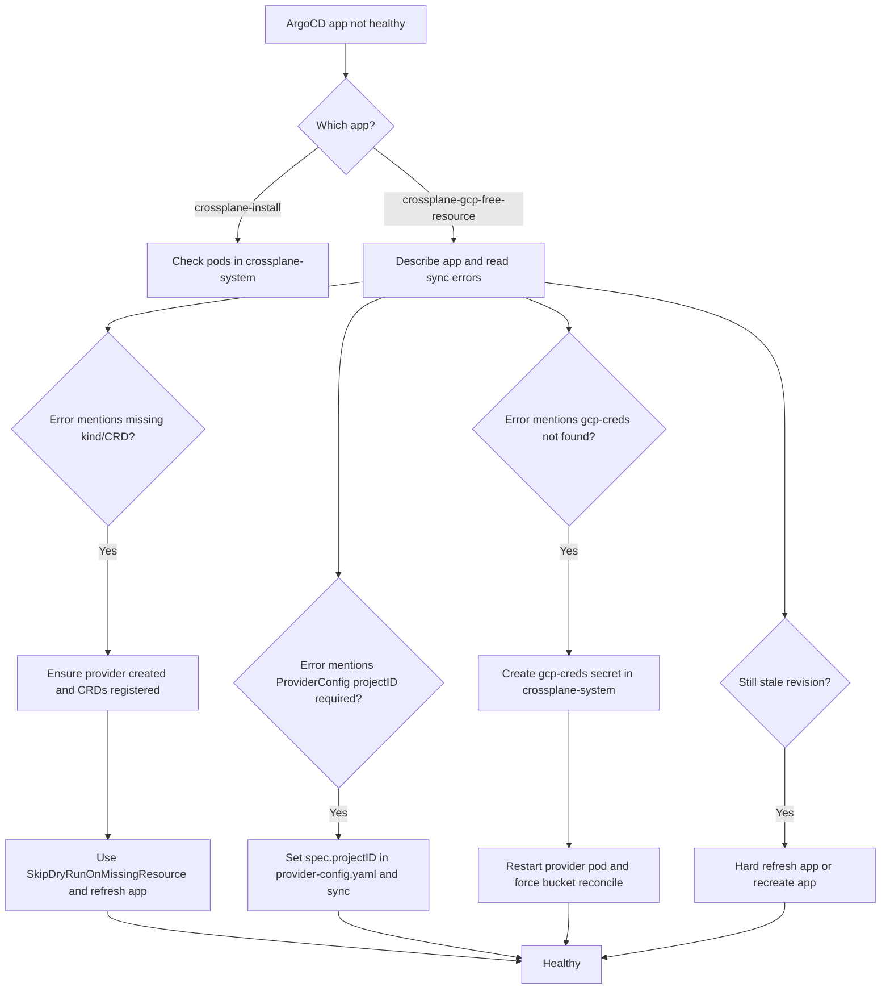

# ArgoCD with kind — Learning Project

A hands-on project for learning [ArgoCD](https://argo-cd.readthedocs.io/) using a local [kind](https://kind.sigs.k8s.io/) (Kubernetes IN Docker) cluster.

---

## Project Structure

```
argoCD/
├── kind-cluster/
│   └── cluster-config.yaml     ← kind cluster definition (ports exposed)
├── sample-app/
│   ├── namespace.yaml           ← Namespace: guestbook
│   ├── deployment.yaml          ← Deployment: guestbook-ui (2 replicas)
│   ├── service.yaml             ← NodePort Service on port 30081
│   └── kustomization.yaml       ← Kustomize entrypoint
├── argocd/
│   ├── application.yaml         ← ArgoCD Application CR (the core object)
│   └── project.yaml             ← ArgoCD AppProject CR (RBAC/scope)
└── scripts/
    ├── setup.ps1                ← Windows one-shot setup script
    ├── setup.sh                 ← Linux/macOS/WSL one-shot setup script
    └── teardown.ps1             ← Delete the cluster
```

---

## Prerequisites

| Tool | Install |
|------|---------|
| Docker Desktop | https://www.docker.com/products/docker-desktop/ |
| kind | `winget install Kubernetes.kind` |
| kubectl | `winget install Kubernetes.kubectl` |
| helm *(optional)* | `winget install Helm.Helm` |

> On Linux/macOS use your package manager or the official install scripts linked above.

---

## Quick Start (Windows)

```powershell
# from repo root
.\scripts\setup.ps1
```

That single script will:
1. Create a kind cluster named **argocd-demo**
2. Install ArgoCD into the `argocd` namespace
3. Patch the ArgoCD server to be reachable on **https://localhost:30080**
4. Print the initial **admin password**
5. Apply the `argocd/application.yaml` so ArgoCD immediately starts syncing the guestbook app

---

## Step-by-Step (manual — great for learning)

### 1 — Create the kind cluster

```powershell
kind create cluster --config kind-cluster\cluster-config.yaml
kubectl cluster-info --context kind-argocd-demo
```

### 2 — Install ArgoCD

```powershell
kubectl create namespace argocd
kubectl apply -n argocd `
  -f https://raw.githubusercontent.com/argoproj/argo-cd/stable/manifests/install.yaml

# Wait until the server pod is Running
kubectl get pods -n argocd -w
```

### 3 — Expose the ArgoCD UI

The kind cluster config already maps container port **30080 → localhost:30080**.  
Patch the service to use a NodePort:

```powershell
kubectl patch svc argocd-server -n argocd `
  -p '{"spec":{"type":"NodePort","ports":[{"port":443,"targetPort":8080,"nodePort":30080}]}}'
```

### 4 — Get the admin password

```powershell
$b64 = kubectl -n argocd get secret argocd-initial-admin-secret -o jsonpath="{.data.password}"
[System.Text.Encoding]::UTF8.GetString([System.Convert]::FromBase64String($b64))
```

Open **https://localhost:30080** → username `admin` → paste the password.

> The browser will warn about a self-signed certificate — click **Advanced → Proceed**.

### 5 — Deploy the guestbook app via ArgoCD

```powershell
kubectl apply -f argocd\application.yaml
```

Go back to the ArgoCD UI. You will see the **guestbook** application appear and transition through:

```
Missing → OutOfSync → Syncing → Synced (Healthy)
```

The guestbook UI will be available at **http://localhost:30081**.

---

## Key ArgoCD Concepts Demonstrated

| Concept | Where |
|---------|-------|
| **Application** CR | `argocd/application.yaml` |
| **AppProject** CR (scoping/RBAC) | `argocd/project.yaml` |
| **Automated sync** (`automated.prune`, `selfHeal`) | `argocd/application.yaml` → `syncPolicy` |
| **Declarative setup** (no UI clicks needed) | `kubectl apply -f argocd/application.yaml` |
| **GitOps loop** (Git is the source of truth) | Any change to `sample-app/` is auto-applied |

---

## Experimenting with GitOps

1. **Push `sample-app/` to your own GitHub repo**
2. Update `argocd/application.yaml` → `spec.source.repoURL` and `path` to point at it
3. `kubectl apply -f argocd/application.yaml`
4. Now edit `sample-app/deployment.yaml` (e.g. change `replicas: 2` → `replicas: 3`), commit & push
5. Watch ArgoCD detect the drift and auto-sync within ~3 minutes (or click **Sync** in the UI)

---

## Useful Commands

```powershell
# Watch ArgoCD application status
kubectl get application -n argocd -w

# Describe an app for events/errors
kubectl describe application guestbook -n argocd

# Force a manual sync
kubectl patch application guestbook -n argocd \
  --type merge -p '{"operation":{"initiatedBy":{"username":"admin"},"sync":{}}}'

# Get all ArgoCD resources
kubectl get all -n argocd

# Delete a specific app (respects the finalizer — cleans up deployed resources too)
kubectl delete application guestbook -n argocd

# Tear down everything
.\scripts\teardown.ps1
```

---

## Architecture Diagram

```
┌─────────────────────────────────────────────────────────┐
│  Your Machine                                           │
│                                                         │
│  Git Repo (GitHub)                                      │
│  └── sample-app/  ◄──────────────────────┐             │
│                                           │ poll / webhook
│  ┌──────────────────────────────────────┐ │             │
│  │  kind cluster (Docker)               │ │             │
│  │                                      │ │             │
│  │  argocd namespace                    │ │             │
│  │  └── argocd-server ──────────────────┘ │             │
│  │      (syncs manifests from Git)        │             │
│  │                                        │             │
│  │  guestbook namespace                   │             │
│  │  └── Deployment: guestbook-ui (2 pods) │             │
│  │  └── Service: NodePort 30081           │             │
│  └────────────────────────────────────────┘             │
│                                                         │
│  localhost:30080 → ArgoCD UI                            │
│  localhost:30081 → Guestbook App                        │
└─────────────────────────────────────────────────────────┘
```



---

## Crossplane + GCP (Free-Tier Friendly)

This repo now includes a full GitOps flow for provisioning a GCP Cloud Storage bucket through ArgoCD + Crossplane.

### Included manifests

- `argocd/crossplane-install-app.yaml`
- `argocd/crossplane-gcp-free-resource-app.yaml`
- `crossplane/gcp/provider-gcp-storage.yaml`
- `crossplane/gcp/provider-config.yaml`
- `crossplane/gcp/gcs-bucket.yaml`
- `crossplane/gcp/provider-credentials-secret.template.yaml`

### One-time setup

1. Create a GCP service account key JSON.
2. Create Kubernetes secret `gcp-creds` in namespace `crossplane-system`.
3. Set your project id in `crossplane/gcp/provider-config.yaml`.
4. Ensure bucket external name in `crossplane/gcp/gcs-bucket.yaml` is globally unique.

### Apply ArgoCD apps

```powershell
kubectl apply -f argocd/crossplane-install-app.yaml
kubectl apply -f argocd/crossplane-gcp-free-resource-app.yaml
```

### Verify health

```powershell
kubectl get applications -n argocd
kubectl get providers.pkg.crossplane.io
kubectl get providerconfig.gcp.upbound.io gcp-provider -o yaml
kubectl get bucket.storage.gcp.upbound.io free-tier-demo-bucket -o yaml
```

Expected:
- `crossplane-install` = `Synced/Healthy`
- `crossplane-gcp-free-resource` = `Synced/Healthy`
- Bucket condition contains `type: Synced`, `status: "True"`

---

## Troubleshooting Guide

This section captures the exact failure patterns seen while setting up this lab and how to fix each one quickly.

### 1) ArgoCD UI not reachable

Symptom:
- `https://localhost:30080` does not open.

Check:

```powershell
kubectl get svc -n argocd argocd-server
```

Fix:

```powershell
kubectl patch svc argocd-server -n argocd -p '{"spec":{"type":"NodePort","ports":[{"name":"https","port":443,"protocol":"TCP","targetPort":8080,"nodePort":30080},{"name":"http","port":80,"protocol":"TCP","targetPort":8080,"nodePort":30082}]}}'
```

### 2) ApplicationSet controller restarting / BackOff

Symptom:
- `argocd-applicationset-controller` repeatedly restarts.
- Logs show `no matches for kind "ApplicationSet"`.

Check:

```powershell
kubectl get crd | Select-String applicationsets.argoproj.io
```

Fix:

```powershell
kubectl create -f https://raw.githubusercontent.com/argoproj/argo-cd/stable/manifests/crds/applicationset-crd.yaml
kubectl rollout restart deployment/argocd-applicationset-controller -n argocd
kubectl rollout status deployment/argocd-applicationset-controller -n argocd --timeout=180s
```

### 3) `crossplane-gcp-free-resource` fails with missing CRDs

Symptom:
- ArgoCD errors with:
  - `could not find gcp.upbound.io/ProviderConfig`
  - `could not find storage.gcp.upbound.io/Bucket`

Cause:
- ArgoCD dry-run runs before provider CRDs are registered.

Fix:
- Ensure `argocd/crossplane-gcp-free-resource-app.yaml` includes:
  - `SkipDryRunOnMissingResource=true`
- Recreate or refresh app:

```powershell
kubectl delete application crossplane-gcp-free-resource -n argocd --wait=true
kubectl apply -f argocd/crossplane-gcp-free-resource-app.yaml
```

### 4) GCP IAM binding fails: service account does not exist

Symptom:
- `INVALID_ARGUMENT: Service account ... does not exist`

Cause:
- Placeholder email used instead of real project id.

Check existing accounts:

```powershell
gcloud iam service-accounts list --project YOUR_PROJECT_ID --format="table(email,displayName)"
```

Use real service account email in binding:

```powershell
gcloud projects add-iam-policy-binding YOUR_PROJECT_ID --member="serviceAccount:crossplane-gcs-lab@YOUR_PROJECT_ID.iam.gserviceaccount.com" --role="roles/storage.admin"
```

### 5) Bucket reconcile error: `Secret "gcp-creds" not found`

Symptom:
- Bucket status message includes secret not found.

Fix:

```powershell
kubectl create secret generic gcp-creds -n crossplane-system --from-file=creds.json=.\your-service-account.json --dry-run=client -o yaml | kubectl apply -f -
kubectl get secret gcp-creds -n crossplane-system
```

If error persists, restart provider pod and force reconcile:

```powershell
kubectl delete pod -n crossplane-system -l pkg.crossplane.io/provider=provider-gcp-storage
kubectl annotate bucket.storage.gcp.upbound.io free-tier-demo-bucket crossplane.io/reconcile=now --overwrite
```

### 6) ProviderConfig validation error: `spec.projectID: Required value`

Symptom:
- ArgoCD sync fails for `ProviderConfig`.

Fix:
- Set real project id in `crossplane/gcp/provider-config.yaml`:

```yaml
spec:
  projectID: YOUR_GCP_PROJECT_ID
```

### 7) ArgoCD app stuck on stale revision/retry loop

Symptom:
- Status still references older commit and repeated retries.

Fix:

```powershell
kubectl annotate application crossplane-gcp-free-resource -n argocd argocd.argoproj.io/refresh=hard --overwrite
```

If still stale:

```powershell
kubectl delete application crossplane-gcp-free-resource -n argocd --wait=true
kubectl apply -f argocd/crossplane-gcp-free-resource-app.yaml
```

---

## Troubleshooting Decision Flow



---

## Security Notes

- Never commit service account key files to Git.
- `.gitignore` already excludes:
  - `your-service-account.json`
  - `*-service-account.json`
  - `gcp-creds.json`
- Rotate or delete service account keys after lab exercises.
